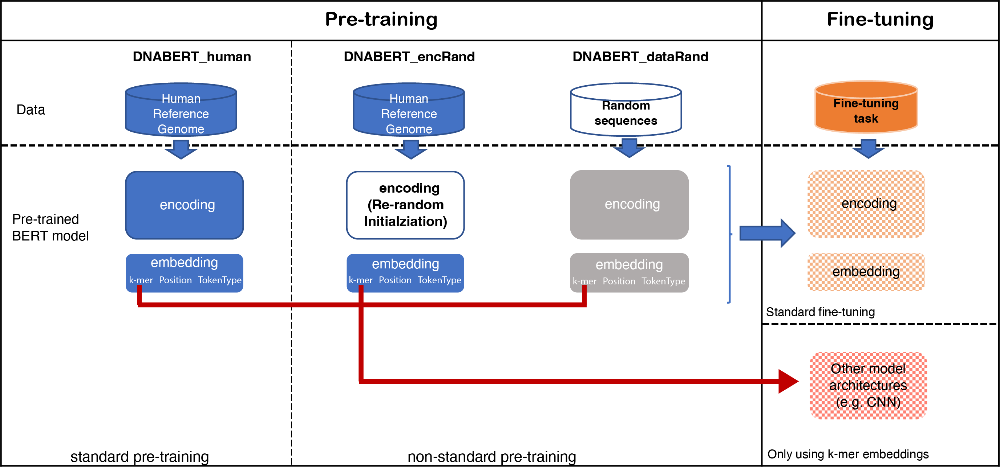

# Investigation of the BERT model on nucleotide sequences with non-standard pre-training and the evaluation of different k-mer embeddings

In this study, we focused on nucleotide sequences and illustrated the learning outcomes of a typical BERT model learned through pre-training.
We used a non-standard pre-training approach to scrutinize different modules by incorporating randomness at both the data and model levels.




## Data

### Pre-training data
* **data/ptData**: source code of generate random sequences.
### Fine-tuning data
* **TATA**: human and mouse dataset are in the fold of **data/ftData/TATA**
* **TFBS**: motif_discovery(690) and motif_occupancy (422) provided by Zeng et al. (https://academic.oup.com/bioinformatics/article/32/12/i121/2240609).
Please use the paper provided URL for the download.


## Source code
* **ft_tasks**: source code of using different k-mer embeddings in downstream tasks of TATA prediciton and TBFS prediction.

### TATA
```
KMER=5
SPIECE= "human" or "mouse"
MODEL="deepPromoterNet"
MODEL_SAVE_PATH=""
DATA_PATH="ftData/TATA/TATA_${SPIECE}/overall"
EMBEDDING="dnabert"
DTYPE="random"
embed_file="path to the k-mer pre-trained on randomly generated sequences"
KERNEL="5,5,5"
LR=1e-4
EPOCH=20
BS=64

CODE="ft_task/TATA/tata_train.py"
python $CODE --kmer $KMER --cnn_kernel_size $KERNEL --model $MODEL --model_dir $MODEL_SAVE_PATH \
    --data_dir $DATA_PATH  --embedding $EMBEDDING \
    --lr $LR --epoch $EPOCH --batch_size $BS --device "cuda:0"
```

### TFBS
```
KMER=5
MODEL="zeng_CNN"
KERNEL="24" 
MODEL_SAVE_PATH=""
DATA_PATH="TBFS/motif_discovery/" or "TBFS/motif_occupancy/"
EMBEDDING="dnabert"
embed_file="path to the k-mer pre-trained on randomly generated sequences"
LR=0.001
EPOCH=10
BS=64

CODE="ft_task/TFBS/TBFS_all_run.py"
python $CODE --kmer $KMER --cnn_kernel_size $KERNEL --model $MODEL --model_dir $MODEL_SAVE_PATH \
	--data_dir $DATA_PATH --embedding $EMBEDDING --embedding_file $embed_file \
	--lr $LR --epoch $EPOCH --batch_size $BS --device "cuda:0" 
```


## Pre-trained models
* **pt_models**:  download link of the pre-trained model using random data.

* 4mer pre-trained on randomly generated sequences:
https://drive.google.com/file/d/1YKKoX_8NRrPR13uGdEQAKWqxBcOvq2su/view?usp=share_link

* 5mer pre-trained on randomly generated sequences:
https://drive.google.com/file/d/1a2OjubusbsXkC2xAp8W0BbVZHuqyCAhk/view?usp=share_link

* 6mer pre-trained on radomly generated sequences:
https://drive.google.com/file/d/1-6XMO70jY9Tdj9R19vgq8u9DtCzDGPkm/view?usp=share_link

## Experiment results
* **results**: detailed results of each dataset of TBFS tasks.
